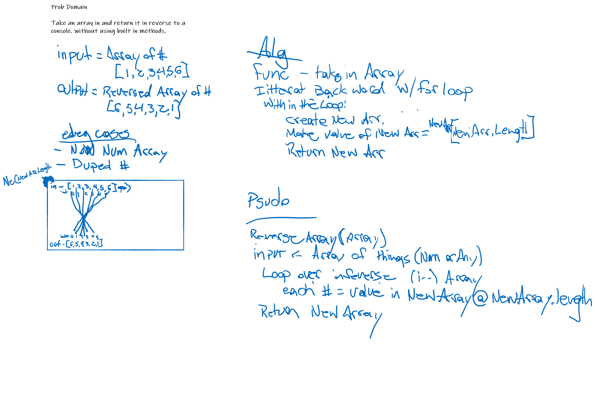

# Reverse An Array

<!-- Short summary or background information -->

## Challenge

Reverse an array in javascript, without using built-in methods

## Approach & Efficiency

- create a new array
- Iterate the array in reverse with a for loop
- At each element, apply the value to the new array from 0 forward.
- console.log to print the new array

## Solution
<!-- Embedded whiteboard image -->

