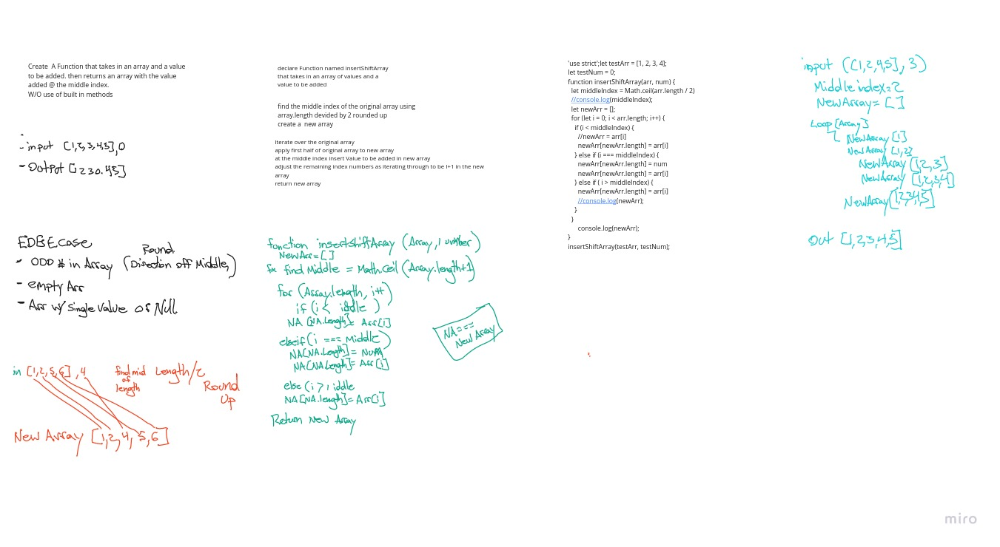

# Array Shift and Insert

<!-- Short summary or background information -->

## Challenge

Add an input to the middle of an array and shift the array around the insert.
With out the use of built in methods.

## Approach & Efficiency

- find the middle index value of the array
- create a new array
- Iterate the original array
- At each element that is less than middle index, apply the value of array to the end new array
- at each element that is equal to the middle index apply the value of insertValue to the end new array
- at each element that is greater than the middle index apply the value of array to the end of new array

- console.log to print the new array

## Solution
<!-- Embedded whiteboard image -->

