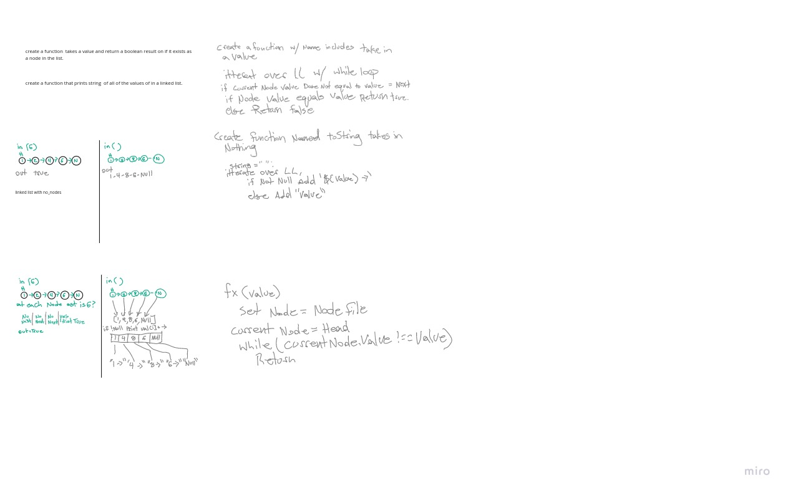
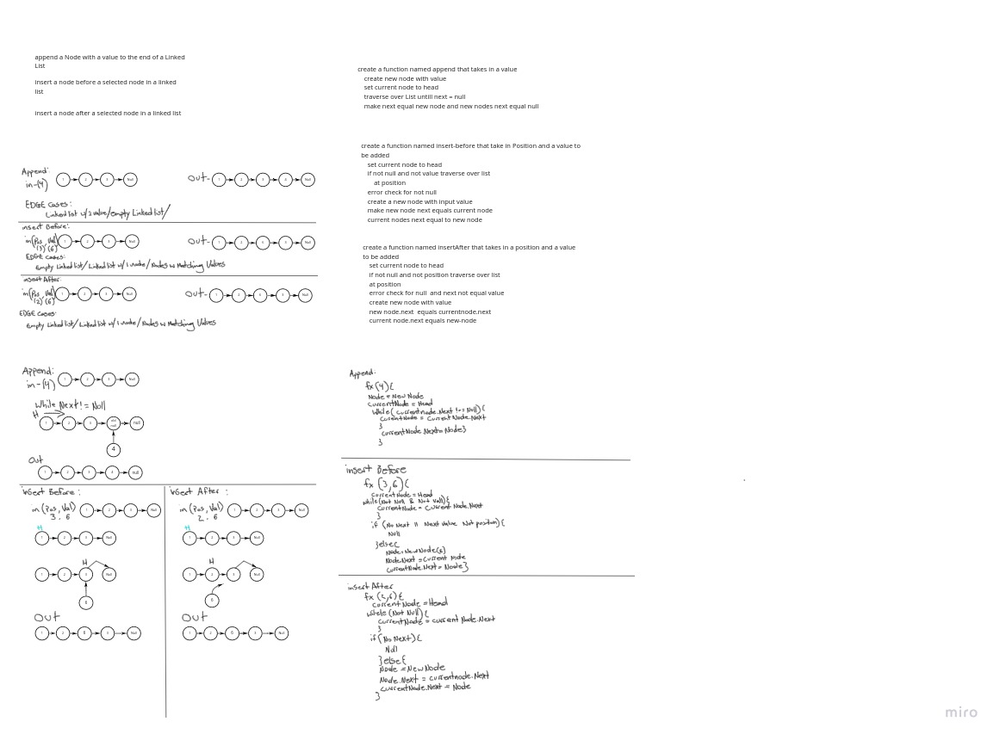
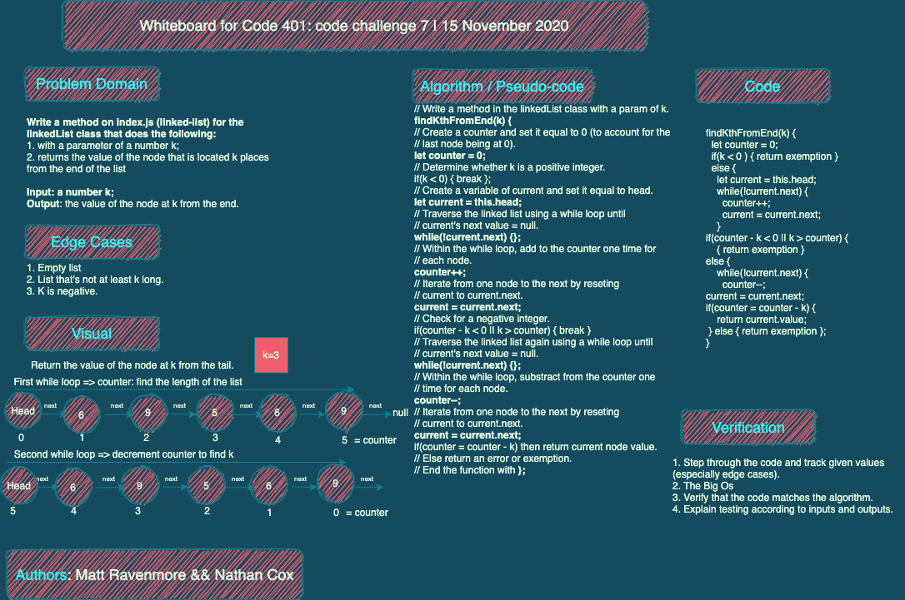
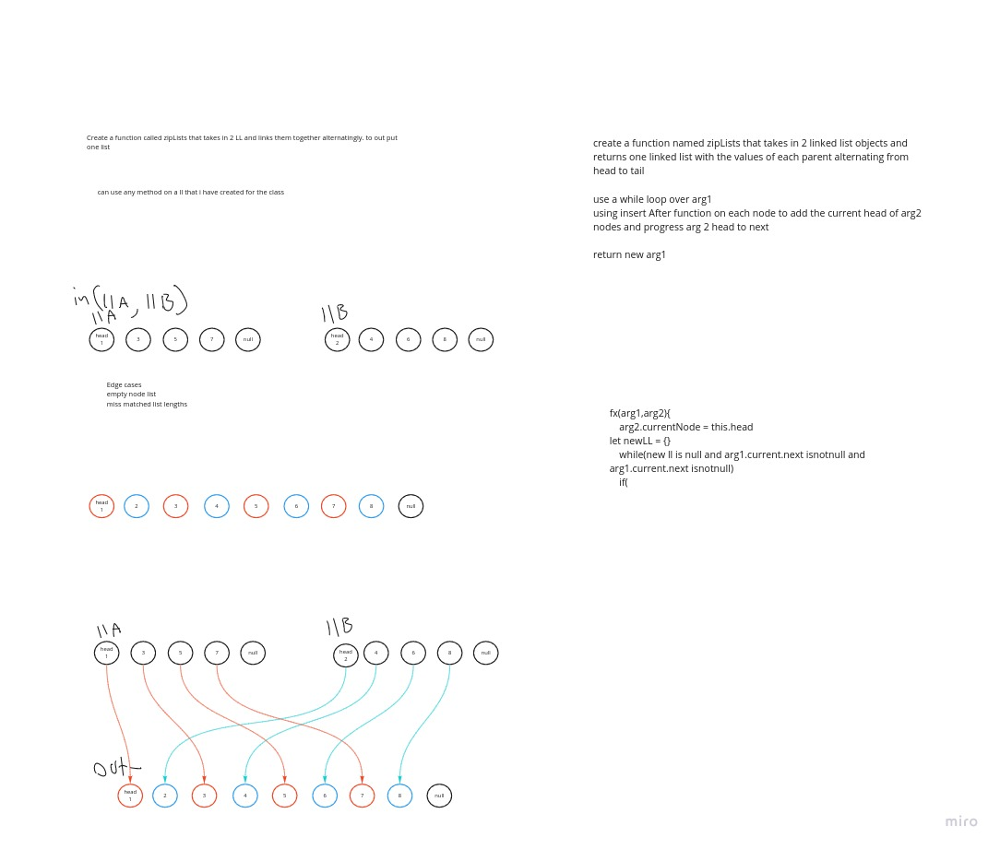

# Array Shift and Insert

<!-- Short summary or background information -->

## Challenge

create a linked list then
add a value to the head of a ll
Return true or false to if a value is in a linked list
print a string of the contents of a linked list
add functions of insert before insert after to our function list.

## Approach & Efficiency

i will update this asap

## Solution
<!-- Embedded whiteboard image -->

