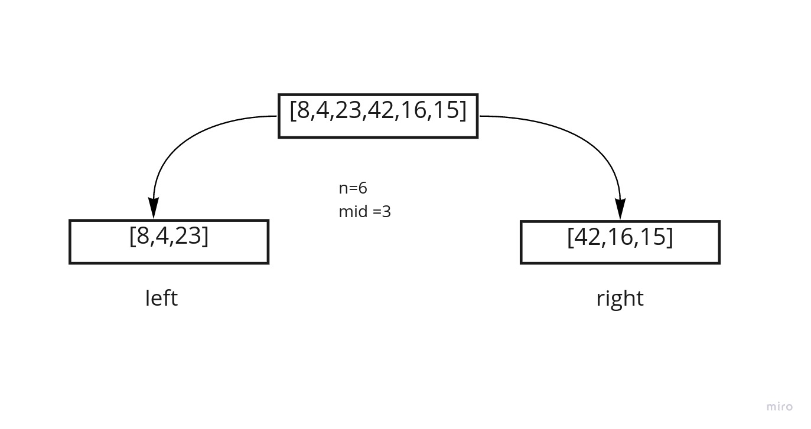
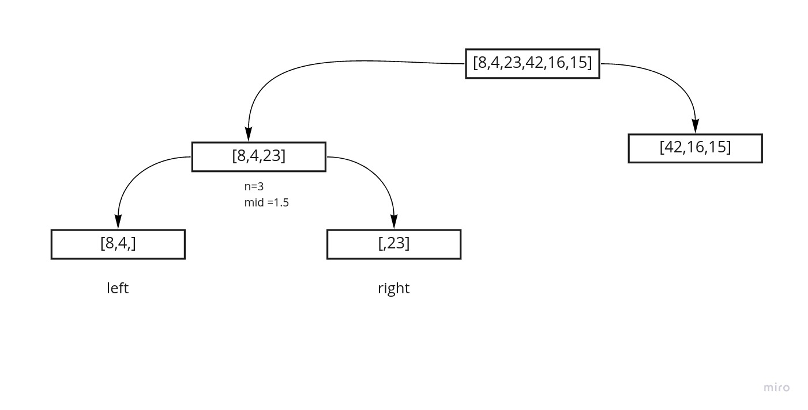
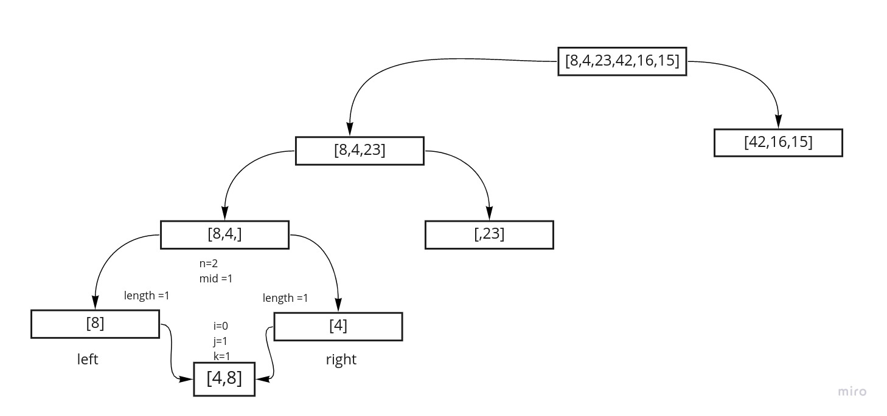
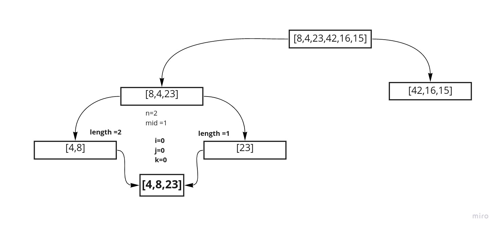
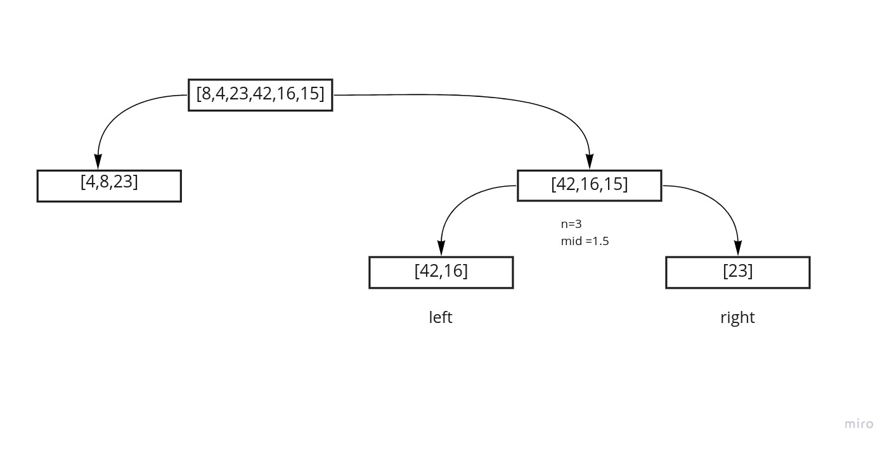
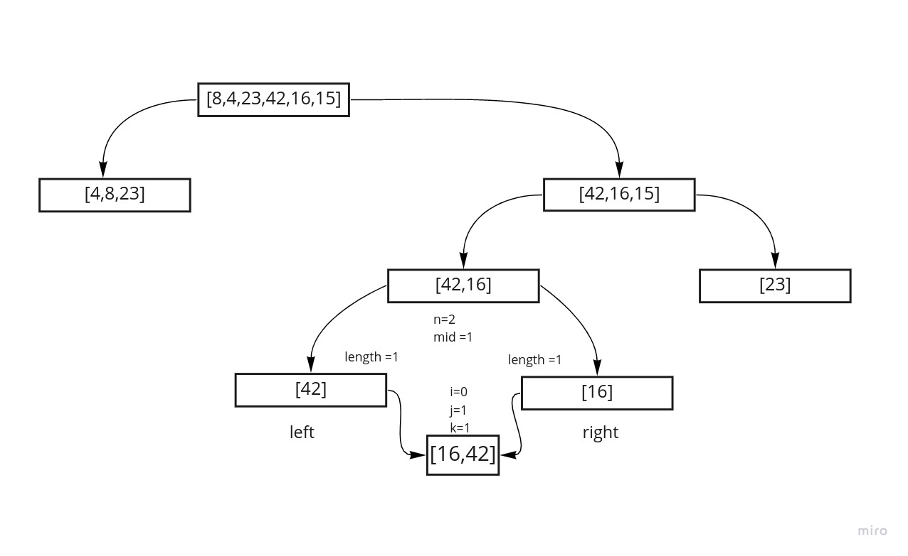
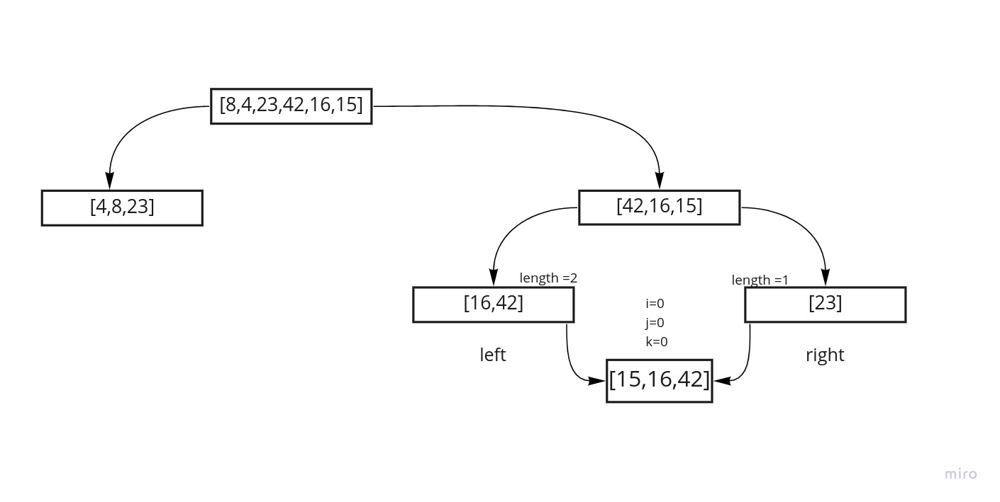
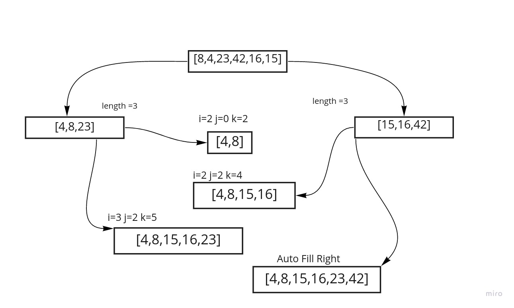

# Merge Sort

## Psuedocode

```
ALGORITHM Mergesort(arr)
    DECLARE n <-- arr.length
           
    if n > 1
      DECLARE mid <-- n/2
      DECLARE left <-- arr[0...mid]
      DECLARE right <-- arr[mid...n]
      // sort the left side
      Mergesort(left)
      // sort the right side
      Mergesort(right)
      // merge the sorted left and right sides together
      Merge(left, right, arr)

ALGORITHM Merge(left, right, arr)
    DECLARE i <-- 0
    DECLARE j <-- 0
    DECLARE k <-- 0

    while i < left.length && j < right.length
        if left[i] <= right[j]
            arr[k] <-- left[i]
            i <-- i + 1
        else
            arr[k] <-- right[j]
            j <-- j + 1
            
        k <-- k + 1

    if i = left.length
       set remaining entries in arr to remaining values in right
    else
       set remaining entries in arr to remaining values in left

```

## Trace

example array `[8,4,23,42,16,15]`

### step 1



at the beging we take in a array and find its length assigning it to the value of n, in our example n at start will equal 6.
we then check to see if our n value is greater than 1 if so we do abunch of logic such as,

we will devide n in half to find the middle of the array and asign that value for us 3 to a variable called mid
we will then assign indices 0 through to mid to a new array called left
and any inicies from mid to end and put them in a right array.

now we will recursivly call the same we are half way through effectivly pausing the rest of this steps logic in order to split up the left array.

#### step 1.1



  At this point we run the function mergesort on the left array from step one for us this is an array looking like [8,4,23].
  we now apply the same logic as before this time n will be 3 the length of the left array. this value is greater than 1 so we enter in to the if logic.
  now the program will devide n in half giving us 1.5 which we will round down to 1.
  the logic will split the array in half again on this mid index makien left look like [8,4] and right look like [23] and again we have a left edge to follow further into the recursion and so will run the function again for the new left array.

#### step 1.1.1



we are 2 layers deep at this point but luckly for our example that is a deep as we will have to go.
here we have run our function mergesort(left) and have an array of [8,4]. its length is 2 so n will be 2.
still we are more than 1 in our array so split it up again to a left and aright on half of n which is 1.
to recap this step we have n=2 mid= 1 left= [8] right =[4]. and we will run the mergesort function one last time to the left to get to our leaf of [8].

#### step 1.1.2



Last left layer wooohooo. currently we have an array of [8,4] with left=[8] and right =[4]  we cant do sort left or right because each has an n=1 thus we enter in to our merge function.

here we are going to make an i,j and k variable and set them to 0. starting a counter to keep track of where we have been. andthen we will compair the values of i and j to the lengths of left and right respectively. and because those values are less then the lengths,(currently they are each 1 and the values of i and j are currently 0) then we will run the following logic;

  if the value of the left at the index of i or currently 0 is greater or equal to the value on the right at index of j or cuurntly 0 then assign the left value to array at index of K also currently 0.
  otherwise put the value on the right in at k.
  here we add the right value of 4 to the array at index 0 then increment the right count of j by 1.
  and upping the current position in the array being the value of k by 1 as well.
  lastly we skip out of the if logic and hit the logic that adds all items on the left if no rights exists. adding the [8] to the array.

  this leaves us with i=0 j=1 k=1 at the end of this phaze and an array of [4,8]

#### step 1.2


here we have steped back up to where we started with the array of [8,4,23]. after the last few steps however we come back into this having just an array of [4,8] on the left and a right [23]. we have completed running the function(left) function (right) creates the [23]. that leaves us running the rest of the function for merge

  once again we compair the length of left and right to i and j here left is 2 right is 1 and i=0 and j=1
  we wont hit the while here we will skip stright to adding all right values and thus end this phaze with the following stats: i=0 j=1 k=1 array [4,8,23]

#### step 2



  This is the first right branch so we now run function (right) with the array [42,16,15]. n now equals 3 so mid will be a rounded down 1 and we will split the arrays to the left [42,16] and right [15] just like before.

#### step 2.1




  left side of the first right branc will get split into 2 single numbered arrays of left = [42] and right=[16].
  now howerver we try to run function(left) and then function(right) neither run becuse our n valuse will be 1 and thus we can run the merge function to compare left to right and put the lower one into the first slot in the parent array thus closing this step of recusion.
  i=0 j=1 k=1 array[16,42]

#### step 2.2


  once again having left be bigger than 1 value makes it skip the left side and just add all right values here and we end up a final setup loking like this
  [15,16,42]

#### step 3




now with both branches resolves to haveing array [8,4,23,42,16,15] left = [4,8,23] right= [15,16,42]
with no more running of function(left) or function(right) the comparitor can run here it would look something like this:

- i=0 j=0 k=0 []
- i=1 j=0 k=1 [4]
- i=2 j=0 k=2 [4,8]
- i=2 j=1 k=3 [4,8,15]
- i=2 j=2 k=4 [4,8,15,16]
- i=3 j=2 k=5 [4,8,15,16,23]
- auto add all right sides becasue all out of left options
  - i=3 j=2 k=5 [4,8,15,16,23,42]


## Effeciency

the big o values are as follows for this function

- Time: O()
  - this is becasue 

- Space: O()
  - this is because
  