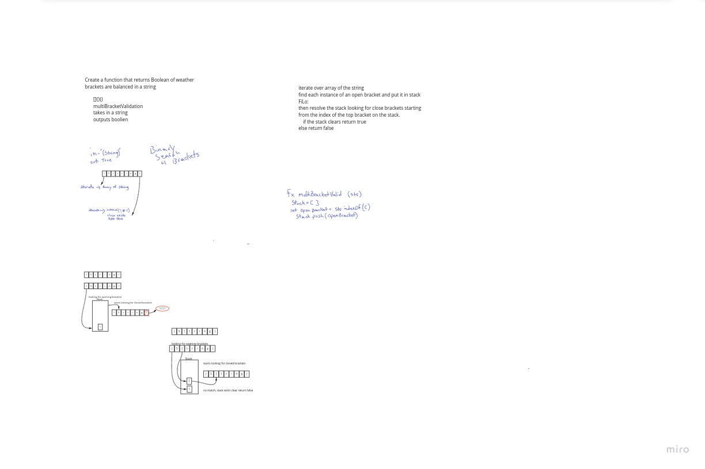

# multi-bracket-validation

<!-- Short summary or background information -->

## Challenge

Create a function that returns Boolean of weather brackets are balanced in a string

## Approach & Efficiency

iterate over array of the string

find each instance of an open bracket and put it in stack FiLo:

then resolve the stack looking for close brackets starting from the index of the top bracket on the stack.

 if the stack clears return true

else return false

## Solution
<!-- Embedded whiteboard image -->
