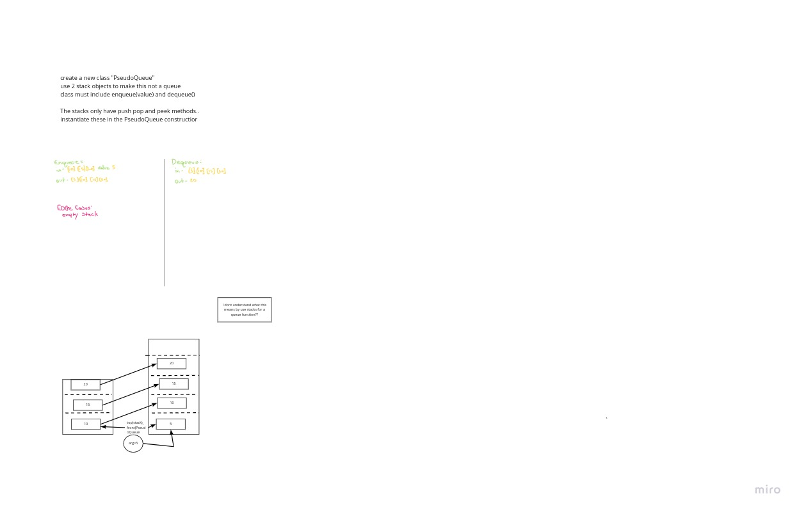

# stacks and queues

<!-- Short summary or background information -->

## Challenge

create a pseudoQueue using stack
 not sure what this means

## Approach & Efficiency

dump the array in to stackA
add value to top of stackA
dump new stackA into stackB revrsing it
inter act with stackB as a queue.

## Solution
<!-- Embedded whiteboard image -->

