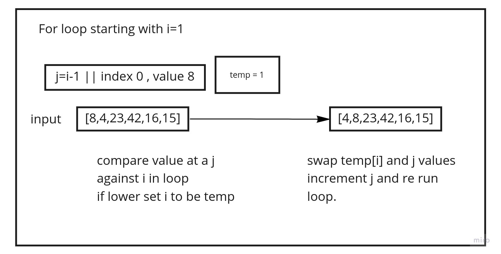
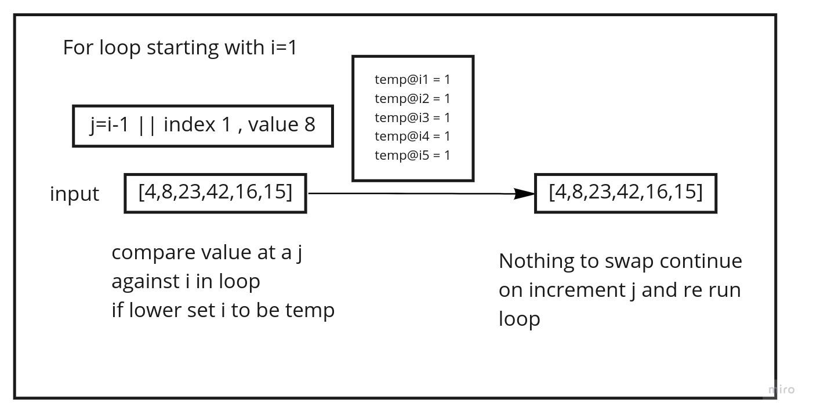
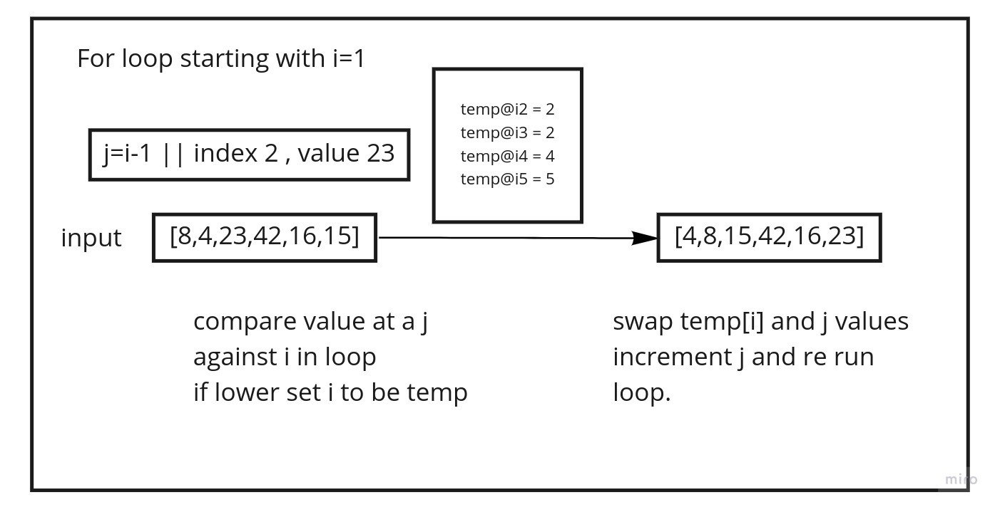
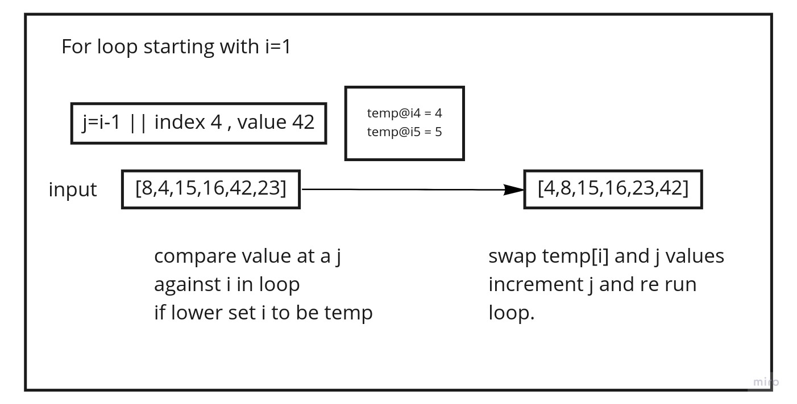
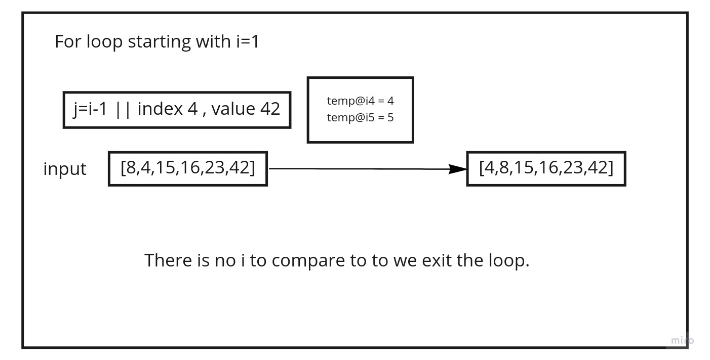

# Selection Sort

This function loops over an array several times compparing the current value aginst the rest of the values to sort from lowest to highest.

## Psuedocode

``` Pseudocode

  InsertionSort(int[] arr)
  
    FOR i = 1 to arr.length
    
      int j <-- i - 1
      int temp <-- arr[i]
      
      WHILE j >= 0 AND temp < arr[j]
        arr[j + 1] <-- arr[j]
        j <-- j - 1
        
      arr[j + 1] <-- temp
```

## Trace

example array `[8,4,23,42,16,15]`

### First Pass


on the first pass the we run through the array of numbers looking for a value less than that of index 0. here that is 8.
at each i of the array if the value is less than 8 it will update temp value to be that index.
at the end of the first run of the loop we update index 0 with the current temp index and move to the next index of 1 and re run the loop.

### Second pass


at the second pass i=1 the value of which is now 8 becasue we moved 4 before it to the 0 position in the last pass.

we now itterate over the remaining array and find that index 1 stays the lowest value and will apply index 1 to index 1 and move on to the next index

### Third Pass


Now at the third pass our i=2 and its value is 23.
we will now itterate over the remaining 3 values in the array and update temp[i] to reflect lowest valued index.

the end of the third pass will show that temp changed from 2 to 4 and then to 5 when compairing to the index values. making temp[i]= 5.
we then assign value at index 2 to the tempoary index  and the tempoary index value to index 2. this swaps them in the array.

### Fourth pass


On our fourth pass we now have i=3 and a value of 42.
we again go and compair this i value to the rest of the values in the array and update our tempoarray index with any index whos value is lower than the current value.
here we end with that temp value equaling index 4 with a value of 16.
so our code will swap the values at the current index and the tempoarry index and move on making i = 4

### Fifth Pass


at the end of our last pass we set i=4 to be 42 and moved to it to compair aginst the last value that is 23.

so once again they swap as index 5 is has a lower value than index 4 currently does. and we have an ordered list.

### Sixth Pass


on this pass we get our i but we are at length so there is nolonger anything to compair to and thus we exit the loop and have compleated our sort.

## Effeciency

the big o values are as follows for this function

- Time: O(n^2)
  - this is becasue we are running a comparitive loop and thus the opperations happen x number of times at each of x number.

- Space: O(1)
  - this is because we are not creating any thing in storage.
  