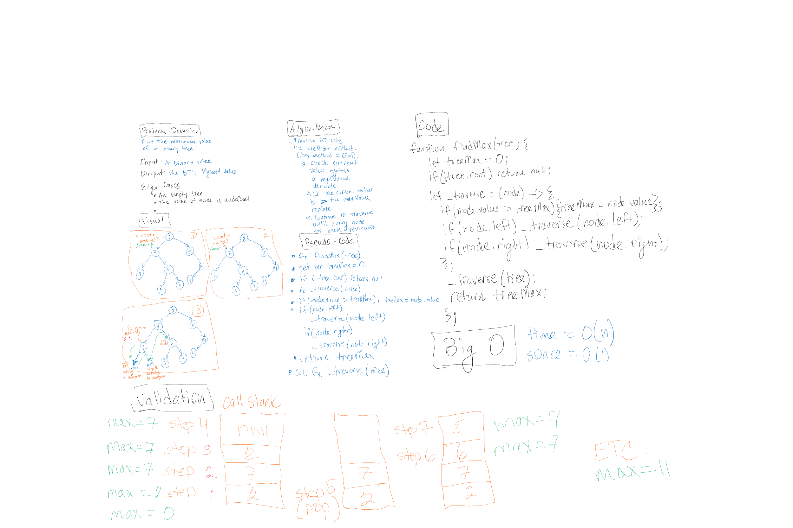
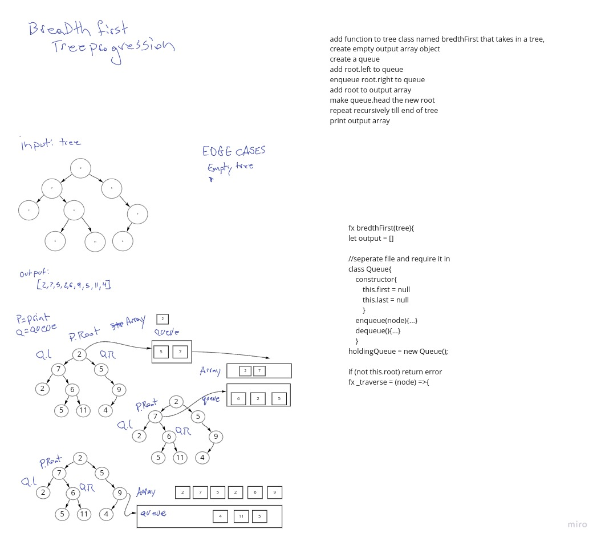
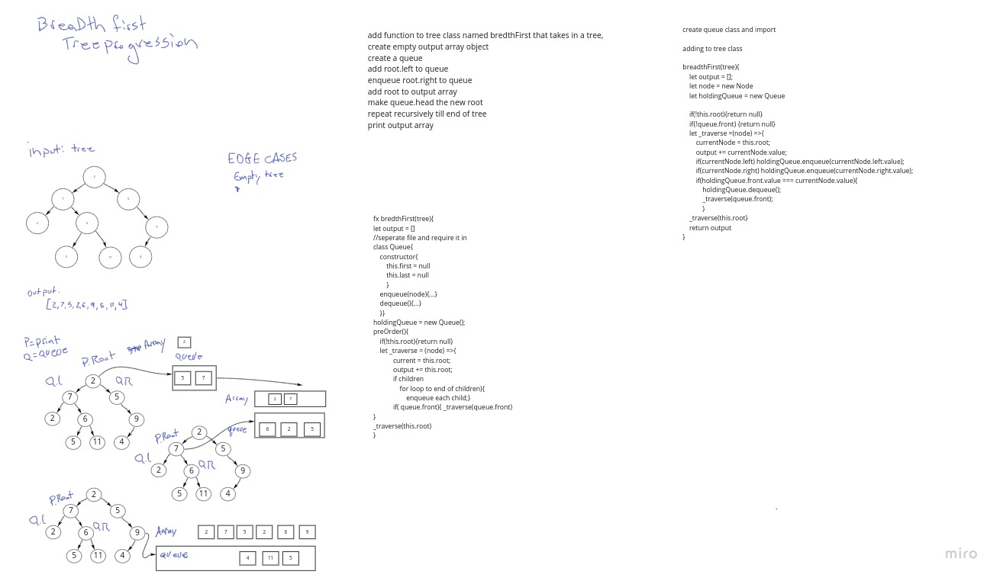

# Trees

<!-- Short summary or background information -->

## Challenge

Trees data structure

## Approach & Efficiency

followed along with a demo on trees provied by lena,

PreOrder Method:
  we add root to the event stack then look at left if there is a left we make it root and and repeet the process if left is null we look at right and do the same

  this order is what changes for Post and In order methods

for contains we look at the value at each node as we taverse in a pre order fassion and when we find a match we will return true. if we dont the we return false

add will find the end of the appropriately weighted tree line and add the number to the end of the line for a balenced search tree.

find max value is like contains but we track the current largest number and return its value at the end instead of true false

## Solution
<!-- Embedded whiteboard image -->
;
;
;
